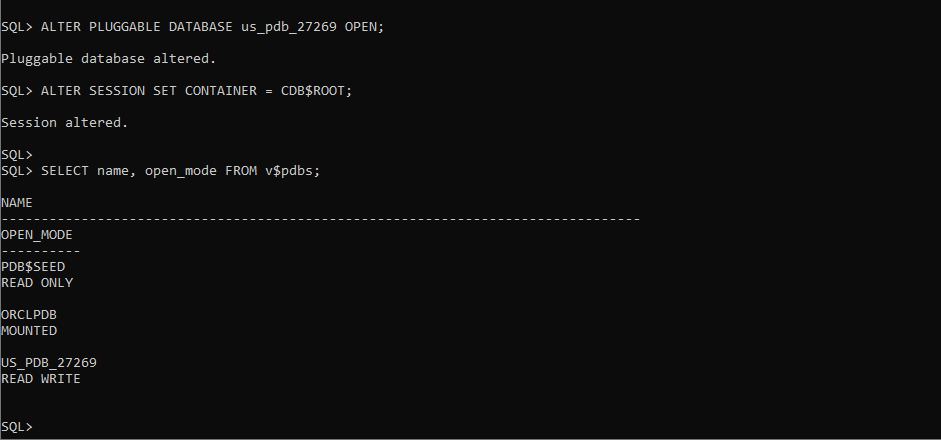
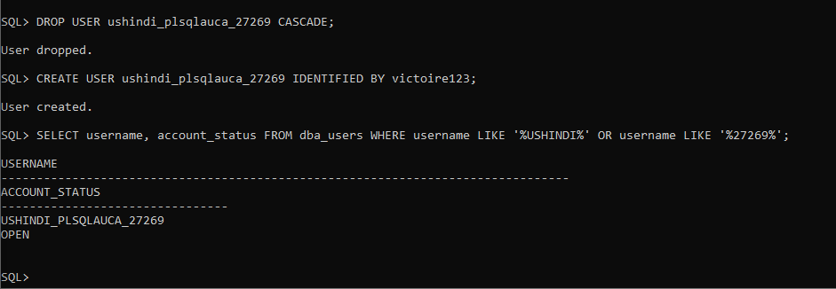

# Assignment II: Database Creation, Deletion & OEM

**Student:** Ushindi Victoire  
**StudentID:** 27269  
**Date:** 2025-09-29  -- 2025-10-06 at 11:59

## Overview
- Task 1: Created PDB `us_pdb_27269` and admin user `ushindi_plsqlauca_27269`.
- Task 2: Created and then deleted PDB `us_to_delete_pdb_27269`.
- Task 3: Accessed EM Express and captured dashboard.

## Commands used
```
sqlplus / as sysdba
ALTER USER system IDENTIFIED BY new_password;
ALTER USER sys IDENTIFIED BY new_password;
ALTER USER victoire IDENTIFIED BY new_password123;
CREATE USER victoire IDENTIFIED BY your_password;
GRANT CONNECT, RESOURCE TO victoire;
-- Show all PDBs
SELECT name, open_mode FROM v$pdbs;

-- Verify your PDB
ALTER SESSION SET CONTAINER = us_pdb_27269;

-- Verify your user
SELECT username, account_status, created FROM dba_users 
WHERE username = 'USHINDI_PLSQLAUCA_27269';

-- Show user privileges
SELECT privilege FROM dba_sys_privs 
WHERE grantee = 'USHINDI_PLSQLAUCA_27269';
See create_pdb.sql and create_then_drop_pdb.sql

ect ...

```

## Screenshots
- 
- 
- 
- 
- 
- 6-privileges-Assigned-to-user 
- 7-Pluggable-database-created 
- 8-Verify-creation 
- 9-Pluggable-database-dropped 
- 10-no-rows-selected 
-

## Issues encountered and fixes
- Missing `libaio.so.1` → installed / created symlink.
- Permission issues while converting RPM → used `alien --scripts` and ensured directories owned by Oracle.
- Issues in getting oracle bin path
- **File path error**: Corrected from `C:\app\Oracle\...` to `C:\ORACLE21C\...`
- **Solution**: Used the correct installation path shown in error message
- Oracle Enterprise Manager not found in standard installation(I am still working on it)

## Conclusion
All tasks completed. If instructor wants access to the database, credentials are:
- PDB admin: `ushindi_plsqlauca_27269` / system
